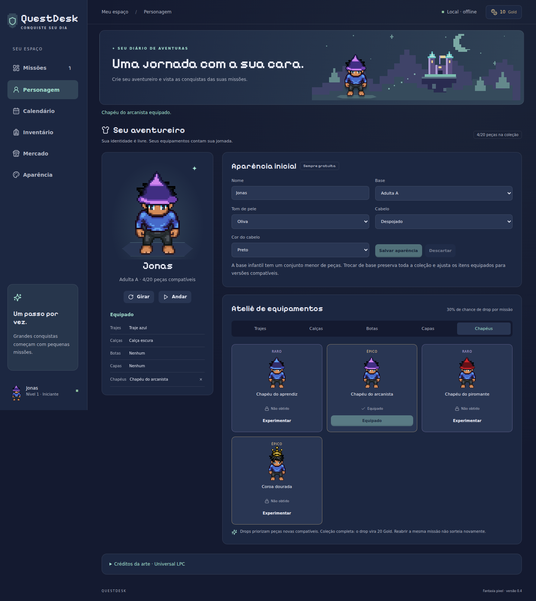

# QuestDesk

**Transforme suas tarefas em uma jornada de fantasia.**

Aplicativo desktop de gestão de tarefas com Kanban, calendário, EXP, Gold e criação de personagem em pixel art.

**Criador e diretor criativo:** [Jonas David Kosniyzeko](https://github.com/jnsdavid95)  
**Versão:** 0.4.0 — primeira versão preparada para publicação, em fase experimental.  
**Código próprio:** proprietário. Consulte [LICENSE.md](LICENSE.md).



## Funcionalidades

- **Missões:** criar e editar tarefas, pesquisar e organizar cards por arrastar e soltar ou seletor de status.
- **Progressão:** EXP, níveis e Gold; cada tarefa concede recompensas uma única vez.
- **Personagens:** três bases, cinco tons de pele, seis cores de cabelo, prévia e caminhada em quatro direções.
- **Equipamentos:** catálogo inicial de 20 peças LPC; 30% de chance de drop na primeira conclusão de uma tarefa, priorizando peças novas compatíveis.
- **Inventário e mercado:** coleção de equipamentos, relíquias e compras com Gold virtual.
- **Calendário:** mês, semana e lista; agendamento de missões e importação/exportação `.ics`.
- **Google Calendar:** leitura de agendas públicas mediante ID e API key. OAuth e sincronização bidirecional ainda não estão implementados.
- **Temas:** Aurora Arcana, Bosque Feérico e Crepúsculo Astral, com cores e cantos ajustáveis.
- **Dados locais:** progresso salvo no dispositivo, sem conta QuestDesk. A agenda pública Google precisa de internet.

## Instalação

Os binários são distribuídos separadamente do código-fonte:

| Sistema | Arquivo | Como abrir |
|---|---|---|
| Windows x64 | `QuestDesk-Setup-0.4.0-windows-x64.exe` | Executar o instalador; atalho no menu Iniciar |
| Linux x86_64 / Bazzite | `QuestDesk-0.4.0-linux-x86_64.AppImage` | Permitir execução e abrir; integração ao menu via Gear Lever |

Não é necessário instalar Node.js para usar esses binários. Veja [instalação e atualização](docs/INSTALACAO.md).

**Estado da validação:** build e 18 testes de domínio aprovados; interface revisada no Chromium; pacotes Windows/Linux gerados e inspecionados. A instalação, abertura e desinstalação nos sistemas de destino ainda precisam ser testadas. O instalador Windows não tem assinatura digital.

## Executar a partir do código

Requisitos de desenvolvimento: Node.js 24 e npm. Na pasta do projeto:

```bash
npm ci
npm run dev
```

Abra o endereço indicado no terminal. Para compilar e abrir o aplicativo desktop:

```bash
npm run desktop
```

O navegador e o desktop usam armazenamentos separados. Instruções de build e empacotamento: [desenvolvimento](docs/DESENVOLVIMENTO.md).

## Documentação

- [Guia de uso](docs/GUIA_DE_USO.md)
- [Instalação, atualização e backup](docs/INSTALACAO.md)
- [Arquitetura e persistência](docs/ARQUITETURA.md)
- [Produto, economia e direção visual](docs/PROJETO.md)
- [Calendário e integrações](docs/CALENDARIO.md)
- [Personagens LPC e drops](docs/PERSONAGEM_LPC.md)
- [Validação e limitações](docs/VALIDACAO.md)
- [Roadmap](docs/ROADMAP.md)
- [Histórico](CHANGELOG.md) e [notas da versão 0.4.0](docs/releases/v0.4.0.md)

## Autoria, licença e terceiros

QuestDesk foi criado e dirigido por **Jonas David Kosniyzeko**. A disponibilização pública do código permite sua consulta, mas não representa uma licença open source. Consulte [autoria](AUTHORS.md), [licença](LICENSE.md) e [orientações para colaborar](CONTRIBUTING.md).

A arte Universal LPC, a fonte Pixelify Sans e as bibliotecas mantêm suas próprias autorias e licenças. A licença proprietária do código QuestDesk não restringe esses componentes. Consulte [avisos de terceiros](THIRD_PARTY_NOTICES.md).
